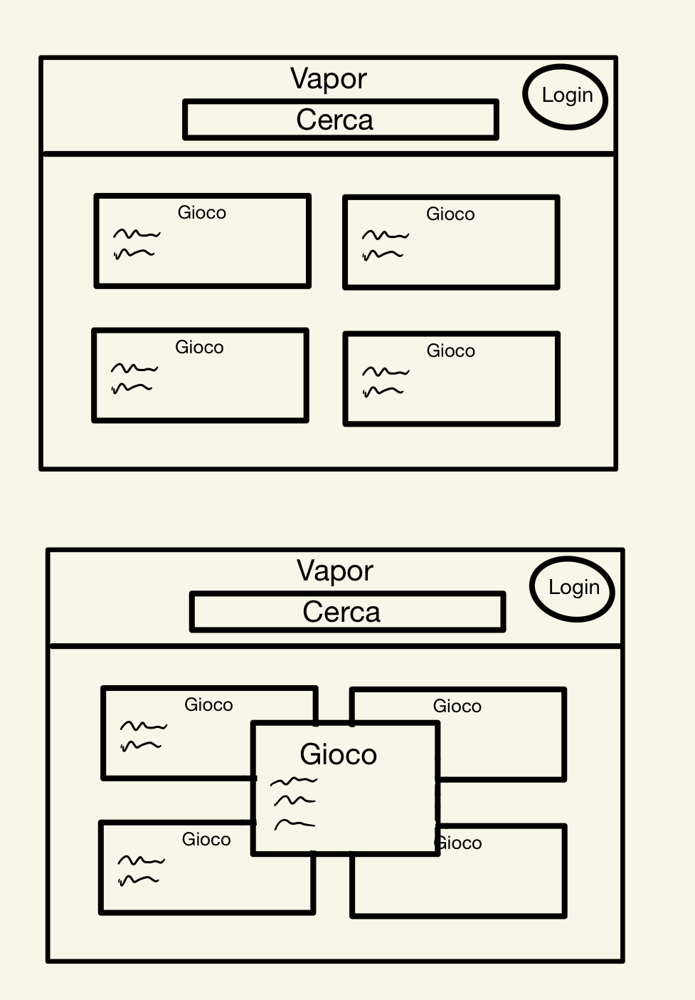

# Progetto-Web-2026 — Vapor

Progetto di Programmazione Web anno 2025/2026.

## Descrizione

**Vapor** è un'applicazione web per la consultazione di un catalogo di videogiochi.

L'utente può visualizzare i giochi disponibili, cercarli tramite nome, piattaforma o
tag, aprire una scheda per visualizzarne i dettagli e, dopo aver effettuato
l'accesso, aggiungere i giochi a una propria lista personale.

L'applicazione è composta da:

- **Frontend** realizzato con HTML, CSS e JavaScript;
- **Backend** realizzato con Node.js ed Express;
- **Database SQLite** per la gestione degli utenti e delle liste personali;
- **File JSON** per la gestione dei dati del catalogo dei giochi;
- **Sessioni** per la gestione dell'autenticazione degli utenti.

---

## Installazione

Dopo aver clonato il repository, installare tutte le dipendenze del progetto con:

```bash
npm install

Non è necessario installare manualmente le singole dipendenze, poiché vengono
installate automaticamente a partire dal file package.json.

Avvio del progetto
Backend
Aprire un terminale nella cartella principale del progetto e avviare il server con:

npm run start

Il server Express viene avviato sulla porta 3000:

http://localhost:3000

Frontend
Il frontend viene aperto tramite Live Server di Visual Studio Code.

È sufficiente aprire il file public/index.html con Live Server.

Il frontend utilizza Live Server per essere eseguito nel browser, mentre le richieste
alle API vengono inviate al backend Express sulla porta 3000.

Funzionalità implementate
Catalogo dei giochi
Visualizzazione della lista completa dei giochi.

Visualizzazione dei giochi tramite card.

Visualizzazione del nome del gioco.

Visualizzazione delle piattaforme disponibili.

Visualizzazione dei tag associati al gioco.

Visualizzazione di collegamenti esterni a HowLongToBeat e alle recensioni.

Apertura della card per visualizzare maggiori dettagli.

Chiusura della card tramite pulsante o clic sull'overlay.

Ricerca
L'utente può cercare i giochi tramite una barra di ricerca.

La ricerca viene effettuata mentre l'utente digita e può trovare corrispondenze
all'interno delle informazioni visualizzate nella card, tra cui:

nome;

piattaforme;

tag.

È inoltre possibile cliccare su un tag per utilizzarlo automaticamente come
termine di ricerca.

Registrazione
Un nuovo utente può creare un account inserendo:

username;

password.

Il server verifica che i dati siano presenti e controlla che lo username non
sia già utilizzato.

Gli utenti vengono salvati nel database SQLite.

Login
Gli utenti registrati possono effettuare il login.

Il server verifica le credenziali e, in caso di successo, crea una sessione tramite
express-session.

Quando l'utente è autenticato, nella pagina principale viene mostrato il suo username.

Menu utente
Dopo il login viene visualizzato un menu contenente:

username dell'utente;

accesso alla lista personale dei giochi;

pulsante per effettuare il logout.

Logout
L'utente può terminare la propria sessione tramite il pulsante "Esci".

Il server distrugge la sessione e l'utente torna allo stato non autenticato.

I miei giochi
Un utente autenticato può aggiungere un gioco alla propria lista personale
tramite il pulsante:

"+ Aggiungi ai miei giochi"

La lista viene salvata nel database SQLite ed è associata all'utente autenticato.

È possibile visualizzare la propria lista tramite:

"I miei giochi"

Il pulsante:

"Tutti i giochi"

permette invece di tornare alla visualizzazione dell'intero catalogo.

Il sistema impedisce inoltre di aggiungere più volte lo stesso gioco alla lista
dello stesso utente.

API REST
Il backend Express espone diverse API REST.

Giochi
GET /api/games
Restituisce la lista completa dei giochi.

Esempio di risposta:

{
    "success": true,
    "games": []
}

GET /api/games/:id
Restituisce un singolo gioco tramite il suo ID.

Esempio:

GET /api/games/1

Il server controlla che l'ID sia un numero intero e che il gioco esista.

I miei giochi
GET /api/my-games
Restituisce la lista dei giochi personali dell'utente autenticato.

Se l'utente non è autenticato, il server restituisce:

401 Unauthorized

POST /api/my-games
Aggiunge un gioco alla lista personale dell'utente.

Il client invia:

{
    "gameId": 1
}

Il server verifica:

che l'utente sia autenticato;

che gameId sia un numero intero;

che il gioco esista;

che il gioco non sia già presente nella lista personale.

Autenticazione
POST /login
Effettua il login dell'utente e crea una sessione.

POST /logout
Distrugge la sessione dell'utente.

GET /api/me
Restituisce le informazioni dell'utente attualmente autenticato.

Registrazione
POST /api/register
Crea un nuovo account.

Il server verifica che username e password siano presenti e che lo username
non sia già utilizzato.

Database
Il progetto utilizza SQLite tramite better-sqlite3.

Il database contiene due tabelle principali.

users
Contiene gli utenti registrati.

Campi:

id

username

password_hash

created_at

user_games
Collega gli utenti ai giochi presenti nella loro lista personale.

Campi:

id

user_id

game_index

added_at

La tabella user_games utilizza una foreign key verso la tabella users.

È inoltre presente un vincolo UNIQUE sulla coppia:

user_id + game_index

in modo da impedire che lo stesso gioco venga aggiunto più volte dallo stesso
utente.

Gestione degli errori
Il backend gestisce diversi casi di errore utilizzando gli opportuni status code HTTP.

400 Bad Request → dati mancanti o non validi;

401 Unauthorized → utente non autenticato o credenziali errate;

404 Not Found → risorsa o endpoint non trovato;

409 Conflict → username già utilizzato o gioco già presente;

500 Internal Server Error → errore interno del server.

Il frontend mostra inoltre messaggi visibili quando non riesce a caricare i giochi
o la lista personale.

Middleware
Il server Express utilizza diversi middleware:

express.json() per il parsing delle richieste JSON;

express.urlencoded() per il parsing dei dati inviati tramite form HTML;

express.static() per servire i file statici del frontend;

cors() per la gestione delle richieste provenienti dal frontend;

express-session per la gestione delle sessioni degli utenti.

Funzionalità extra
Oltre ai requisiti minimi richiesti dalla traccia, sono state implementate
le seguenti funzionalità:

registrazione degli utenti;

login e logout;

autenticazione tramite sessione;

database SQLite;

lista personale dei giochi;

associazione tra utenti e giochi;

controllo dei giochi duplicati;

ricerca e filtro dei giochi;

apertura delle card con visualizzazione dei dettagli;

collegamenti esterni a HowLongToBeat e alle recensioni.

Uso dell'intelligenza artificiale
Durante lo sviluppo del progetto è stato utilizzato ChatGPT come strumento
di supporto.

L'intelligenza artificiale è stata utilizzata per:

supportare la progettazione della struttura dell'applicazione;

generare e revisionare parti di codice HTML, CSS e JavaScript;

supportare la realizzazione delle API Express;

supportare l'integrazione del database SQLite;

individuare e correggere errori;

supportare la gestione delle sessioni e dell'autenticazione;

verificare la corrispondenza del progetto con i requisiti della traccia.

Il codice suggerito o generato dall'AI è stato verificato, modificato e integrato
nel progetto in base alle esigenze dell'applicazione.

Durante lo sviluppo sono state inoltre apportate modifiche manuali al codice
per adattarlo alla struttura e alle funzionalità di Vapor.

I prompt e le specifiche utilizzati durante lo sviluppo vengono conservati per
poter documentare il processo di utilizzo dell'AI durante la discussione orale.

Struttura del progetto
Progetto-Web-2026/
│
├── public/
│   ├── index.html
│   ├── login.html
│   ├── register.html
│   ├── main.js
│   ├── style.css
│   ├── login.css
│   └── images/
│
├── specifiche/
│   └── ...
│
├── db.js
├── games.json
├── server.js
├── package.json
├── package-lock.json
├── vapor.db
└── README.md

Tecnologie utilizzate
HTML5

CSS3

JavaScript

Node.js

Express

SQLite

better-sqlite3

express-session

CORS

Git

GitHub

Mockup:


